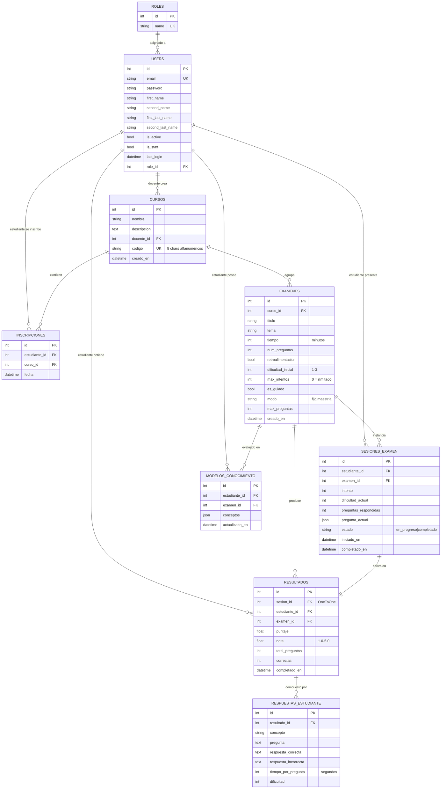

# Documento 3 — Esquema de Base de Datos y Configuración del Módulo Administrador

**Proyecto**: Lairn — Sistema Inteligente de Aprendizaje Adaptativo
**Tipo de documento**: Documento técnico con evidencias visuales
**Versión**: 0.9 (versión avanzada, próxima a final)
**Estado de avance reportado**: 90 %
**Fecha de última actualización**: 2026-05-24

> **Nota sobre el estado del documento.** Este es el entregable más maduro del conjunto. La estructura de base de datos está implementada, migrada y funcionando en producción interna. Lo que resta para alcanzar el 100 % es: (a) ampliar tres tablas con los campos necesarios para alimentar los modelos de Knowledge Tracing descritos en el Documento 2, y (b) poblar las tablas con un dataset real de uso a mediano plazo.

---

## 1. Introducción

La base de datos de Lairn fue diseñada para soportar simultáneamente tres tipos de cargas:

1. **Operación transaccional**: cursos, inscripciones, exámenes, sesiones.
2. **Generación dinámica de contenido**: almacenamiento de la pregunta actual de cada sesión, generada por el agente IA en tiempo real.
3. **Analítica y entrenamiento de modelos**: registro granular de cada interacción del estudiante para alimentar al motor adaptativo y a los modelos de Knowledge Tracing.

El sistema utiliza **PostgreSQL 15** como motor de base de datos, gestionado mediante el ORM de Django 5.x y desplegado dentro de un contenedor Docker que se levanta en conjunto con la aplicación.

### 1.1 Objetivos del documento

1. Presentar el diagrama entidad-relación (DER) actualizado del esquema de Lairn.
2. Documentar cada tabla, sus campos, tipos y relaciones.
3. Justificar las decisiones de diseño relevantes.
4. Reportar el estado operativo de cada tabla (qué está activa, qué falta).
5. Definir las capturas del sistema funcionando que acompañan al documento.

### 1.2 Alcance

El documento cubre las tablas funcionales del dominio educativo y los esquemas auxiliares de Django y SimpleJWT necesarios para el funcionamiento del sistema. No se documentan tablas internas de PostgreSQL ni `pg_catalog`.

---

## 2. Visión General del Esquema

El esquema actual cuenta con **9 tablas de dominio**, organizadas en 4 apps de Django, más las tablas auxiliares de Django y SimpleJWT.

### 2.1 Distribución por app

| App | Tablas | Responsabilidad |
|---|---|---|
| `users` | `roles`, `users` | Autenticación y autorización |
| `examenes` | `cursos`, `inscripciones`, `examenes` | Estructura académica |
| `motor_adaptativo` | `sesiones_examen`, `modelos_conocimiento` | Estado dinámico durante un examen |
| `analitica` | `resultados`, `respuestas_estudiante` | Trazabilidad histórica para analítica |

### 2.2 Tablas auxiliares (Django + SimpleJWT)

| Tabla | Propósito |
|---|---|
| `django_migrations` | Historial de migraciones aplicadas |
| `django_session` | Sesiones HTTP (no usadas si se opera 100 % vía JWT) |
| `auth_permission`, `auth_group`, `auth_group_permissions` | Sistema de permisos de Django |
| `token_blacklist_outstandingtoken` | Tokens JWT emitidos |
| `token_blacklist_blacklistedtoken` | Tokens JWT invalidados al cerrar sesión |

---

## 3. Diagrama Entidad-Relación

### 3.1 Diagrama en formato Mermaid



### 3.2 Resumen textual de las relaciones

- Un **Rol** puede tener muchos **Usuarios** (un usuario un solo rol).
- Un **Usuario** con rol Docente puede crear muchos **Cursos**.
- Un **Usuario** con rol Estudiante puede tener muchas **Inscripciones** (una por curso).
- Un **Curso** contiene muchos **Exámenes**.
- Un **Examen** se instancia en muchas **Sesiones de Examen** (una por estudiante por intento).
- Cada **Sesión de Examen** completada deriva en exactamente un **Resultado** (relación 1:1).
- Un **Resultado** se compone de muchas **Respuestas del Estudiante** (una por pregunta).
- Un **Estudiante** posee un **Modelo de Conocimiento** por cada **Examen** en el que ha trabajado.

---

## 4. Descripción Detallada de Tablas

### 4.1 Tabla `roles`

**App**: `users` · **Archivo**: `apps/users/models/role.py`

| Campo | Tipo | Restricciones | Descripción |
|---|---|---|---|
| `id` | Integer | PK, auto | Identificador único |
| `name` | CharField(50) | UNIQUE, NOT NULL | Nombre del rol (Administrador, Docente, Estudiante) |

**Justificación**: separar el rol en una tabla aparte (en lugar de un Enum en `users`) permite extender los roles a futuro (por ejemplo, "Tutor", "Coordinador") sin migraciones de esquema.

**Estado**: operativa. Poblada inicialmente vía `python manage.py seed_roles`.

---

### 4.2 Tabla `users`

**App**: `users` · **Archivo**: `apps/users/models/user.py`

| Campo | Tipo | Restricciones | Descripción |
|---|---|---|---|
| `id` | Integer | PK, auto | Identificador único |
| `email` | EmailField | UNIQUE, NOT NULL | Correo electrónico (es el USERNAME_FIELD) |
| `password` | CharField | NOT NULL | Hash de contraseña (PBKDF2 por defecto en Django) |
| `first_name` | CharField(50) | NOT NULL | Primer nombre |
| `second_name` | CharField(50) | NULL OK | Segundo nombre |
| `first_last_name` | CharField(50) | NOT NULL | Primer apellido |
| `second_last_name` | CharField(50) | NULL OK | Segundo apellido |
| `is_active` | Boolean | DEFAULT TRUE | Si el usuario puede iniciar sesión |
| `is_staff` | Boolean | DEFAULT FALSE | Si tiene acceso al panel `/admin/` |
| `last_login` | DateTime | NULL OK | Último inicio de sesión |
| `role_id` | Integer | FK → `roles.id`, ON DELETE SET NULL | Rol del usuario |

**Justificación**:
- Se usa email como `USERNAME_FIELD` (no `username`), porque es un dato natural del dominio educativo y no se requiere doble identificador.
- La separación de nombres y apellidos en cuatro campos (en lugar de uno solo) es estándar en sistemas educativos en Latinoamérica.
- El borrado de un rol no debe borrar usuarios; por eso `ON DELETE SET NULL`.

**Estado**: operativa. Poblada con usuarios de prueba vía `python manage.py seed_usuarios`.

---

### 4.3 Tabla `cursos`

**App**: `examenes` · **Archivo**: `apps/examenes/models/curso.py`

| Campo | Tipo | Restricciones | Descripción |
|---|---|---|---|
| `id` | Integer | PK, auto | Identificador único |
| `nombre` | CharField(100) | NOT NULL | Nombre del curso |
| `descripcion` | Text | DEFAULT '' | Descripción libre |
| `docente_id` | Integer | FK → `users.id`, ON DELETE CASCADE | Docente propietario |
| `codigo` | CharField(8) | UNIQUE, DEFAULT auto | Código de acceso de 8 caracteres alfanuméricos |
| `creado_en` | DateTime | auto_now_add | Fecha de creación |

**Justificación**:
- El campo `codigo` se autogenera con caracteres alfanuméricos en mayúsculas. Sirve como token corto y opaco que el docente comparte con sus estudiantes para que se inscriban sin exponer el `id` interno.
- Borrar al docente elimina sus cursos en cascada porque sin docente el curso pierde sentido operativo.

**Estado**: operativa con CRUD completo (Documento de endpoints, secciones 6-10).

---

### 4.4 Tabla `inscripciones`

**App**: `examenes` · **Archivo**: `apps/examenes/models/inscripcion.py`

| Campo | Tipo | Restricciones | Descripción |
|---|---|---|---|
| `id` | Integer | PK, auto | Identificador único |
| `estudiante_id` | Integer | FK → `users.id`, ON DELETE CASCADE | Estudiante inscrito |
| `curso_id` | Integer | FK → `cursos.id`, ON DELETE CASCADE | Curso al que se inscribió |
| `fecha` | DateTime | auto_now_add | Fecha de inscripción |
|   | | UNIQUE(`estudiante_id`, `curso_id`) | Evita inscripciones duplicadas |

**Justificación**:
- Tabla intermedia explícita en lugar de un `ManyToManyField`, para poder agregar metadata (fecha y eventualmente más campos como estado de la inscripción, fecha de aprobación, etc.).
- La restricción `unique_together` garantiza a nivel de base de datos que un mismo estudiante no se pueda inscribir dos veces al mismo curso, incluso ante condiciones de carrera.

**Estado**: operativa. Endpoint de inscripción funcional.

---

### 4.5 Tabla `examenes`

**App**: `examenes` · **Archivo**: `apps/examenes/models/examen.py`

| Campo | Tipo | Restricciones | Descripción |
|---|---|---|---|
| `id` | Integer | PK, auto | Identificador único |
| `curso_id` | Integer | FK → `cursos.id`, ON DELETE CASCADE | Curso al que pertenece |
| `titulo` | CharField(200) | NOT NULL | Título mostrado al estudiante |
| `tema` | CharField(200) | NOT NULL | Tema sobre el que el agente generará preguntas |
| `tiempo` | Integer | NOT NULL | Duración en minutos |
| `num_preguntas` | Integer | NOT NULL | Cantidad de preguntas (fijo) o mínimo (maestría) |
| `retroalimentacion` | Boolean | DEFAULT FALSE | Si se muestra acierto/error tras cada respuesta |
| `dificultad_inicial` | Integer | CHOICES {1, 2, 3}, DEFAULT 2 | Dificultad de la primera pregunta |
| `max_intentos` | Integer | DEFAULT 1 | Intentos permitidos (0 = ilimitado) |
| `es_guiado` | Boolean | DEFAULT FALSE | Si el agente genera explicación antes de cada pregunta |
| `modo` | CharField(10) | CHOICES {fijo, maestria}, DEFAULT fijo | Criterio de finalización |
| `max_preguntas` | Integer | DEFAULT 20 | Tope absoluto en modo maestría |
| `creado_en` | DateTime | auto_now_add | Fecha de creación |

**Justificación**:
- Los parámetros del examen (dificultad inicial, modo, intentos) son metadata de **configuración**, no de contenido. Las preguntas en sí no se almacenan acá porque se generan dinámicamente por el agente IA en cada sesión.
- El modo dual `fijo` vs `maestria` permite cubrir dos paradigmas pedagógicos en la misma estructura: evaluaciones tradicionales y evaluaciones por dominio.

**Estado**: operativa con CRUD completo (Documento de endpoints, secciones 11-14). El CRUD incluye bloqueo de update/delete cuando hay sesiones en curso.

---

### 4.6 Tabla `sesiones_examen`

**App**: `motor_adaptativo` · **Archivo**: `apps/motor_adaptativo/models/sesion_examen.py`

| Campo | Tipo | Restricciones | Descripción |
|---|---|---|---|
| `id` | Integer | PK, auto | Identificador único |
| `estudiante_id` | Integer | FK → `users.id`, ON DELETE CASCADE | Estudiante que presenta |
| `examen_id` | Integer | FK → `examenes.id`, ON DELETE CASCADE | Examen presentado |
| `intento` | Integer | DEFAULT 1 | Número de intento del estudiante |
| `dificultad_actual` | Integer | DEFAULT 2 | Dificultad ajustada dinámicamente |
| `preguntas_respondidas` | Integer | DEFAULT 0 | Contador para condiciones de fin |
| `pregunta_actual` | JSON | NULL OK | Pregunta vigente generada por el agente IA |
| `estado` | CharField(20) | CHOICES {en_progreso, completado}, DEFAULT en_progreso | Estado de la sesión |
| `iniciado_en` | DateTime | auto_now_add | Inicio de la sesión |
| `completado_en` | DateTime | NULL OK | Fin de la sesión (NULL mientras esté en progreso) |
|   | | UNIQUE(`estudiante_id`, `examen_id`, `intento`) | Un intento único por estudiante-examen |

**Justificación**:
- El campo `pregunta_actual` es un `JSONField` porque la estructura de una pregunta (texto, opciones, concepto, explicación opcional) puede evolucionar sin requerir migración.
- La restricción de unicidad sobre `(estudiante, examen, intento)` permite múltiples intentos del mismo estudiante al mismo examen, controlados por el campo `max_intentos` del examen.
- El estado `en_progreso` es el que dispara el **bloqueo de update/delete** sobre el examen padre (ver Documento 4 — bloqueo por sesión activa en la lógica de negocio).

**Estado**: operativa. Núcleo del motor adaptativo en funcionamiento.

---

### 4.7 Tabla `modelos_conocimiento`

**App**: `motor_adaptativo` · **Archivo**: `apps/motor_adaptativo/models/modelo_conocimiento.py`

| Campo | Tipo | Restricciones | Descripción |
|---|---|---|---|
| `id` | Integer | PK, auto | Identificador único |
| `estudiante_id` | Integer | FK → `users.id`, ON DELETE CASCADE | Estudiante |
| `examen_id` | Integer | FK → `examenes.id`, ON DELETE CASCADE | Examen |
| `conceptos` | JSON | DEFAULT {} | Diccionario de conceptos y su estado |
| `actualizado_en` | DateTime | auto_now | Última actualización |
|   | | UNIQUE(`estudiante_id`, `examen_id`) | Un modelo por par estudiante-examen |

**Estructura del JSON `conceptos`**:

```json
{
  "derivada de seno": {
    "intentos": 5,
    "correctas": 5,
    "nivel": 3
  },
  "derivada de coseno": {
    "intentos": 4,
    "correctas": 2,
    "nivel": 1
  }
}
```

Donde `nivel` es:
- `1` = débil (<50 % aciertos)
- `2` = en desarrollo (50-79 %)
- `3` = dominado (≥80 %)

**Justificación**:
- Se usa un `JSONField` en lugar de una tabla relacional con `(modelo_id, concepto, intentos, correctas, nivel)` por dos razones: (a) los conceptos son emergentes y no están normalizados como entidad, (b) el acceso es siempre como bloque completo, no por concepto individual.
- Esta decisión **se revisará** cuando se implemente el modelo de KT del Documento 2, ya que un esquema relacional facilitaría el entrenamiento de modelos secuenciales.

**Estado**: operativa.

---

### 4.8 Tabla `resultados`

**App**: `analitica` · **Archivo**: `apps/analitica/models/resultado.py`

| Campo | Tipo | Restricciones | Descripción |
|---|---|---|---|
| `id` | Integer | PK, auto | Identificador único |
| `sesion_id` | Integer | FK → `sesiones_examen.id`, ON DELETE CASCADE, **OneToOne** | Sesión que produjo el resultado |
| `estudiante_id` | Integer | FK → `users.id`, ON DELETE CASCADE | Estudiante |
| `examen_id` | Integer | FK → `examenes.id`, ON DELETE CASCADE | Examen |
| `puntaje` | Float | DEFAULT 0 | Porcentaje de aciertos (0-100) |
| `nota` | Float | DEFAULT 1.0 | Calificación en escala 1.0 a 5.0 |
| `total_preguntas` | Integer | NOT NULL | Preguntas respondidas |
| `correctas` | Integer | DEFAULT 0 | Preguntas acertadas |
| `completado_en` | DateTime | auto_now_add | Fecha de finalización |

**Justificación**:
- Relación 1:1 con `sesiones_examen` porque cada sesión completada produce exactamente un resultado.
- Se denormalizan `estudiante` y `examen` (aunque son derivables vía la sesión) para acelerar consultas analíticas frecuentes.
- La nota usa escala 1.0-5.0 estándar en el sistema educativo colombiano. Fórmula: `nota = 1.0 + (correctas / total_preguntas) × 4.0`.

**Estado**: operativa.

---

### 4.9 Tabla `respuestas_estudiante`

**App**: `analitica` · **Archivo**: `apps/analitica/models/resultado.py`

| Campo | Tipo | Restricciones | Descripción |
|---|---|---|---|
| `id` | Integer | PK, auto | Identificador único |
| `resultado_id` | Integer | FK → `resultados.id`, ON DELETE CASCADE | Resultado al que pertenece |
| `concepto` | CharField(200) | DEFAULT '' | Concepto evaluado por la pregunta |
| `pregunta` | Text | NOT NULL | Enunciado completo |
| `respuesta_correcta` | Text | NOT NULL | Respuesta correcta esperada |
| `respuesta_incorrecta` | Text | DEFAULT '' | Respuesta marcada (si no acertó) |
| `tiempo_por_pregunta` | Integer | NOT NULL | Tiempo en segundos |
| `dificultad` | Integer | NOT NULL | Dificultad de la pregunta (1-3) |

**Justificación**:
- Es la tabla más importante para entrenamiento de modelos de Knowledge Tracing: contiene una fila por interacción granular.
- Almacenar el texto de pregunta y respuesta (en lugar de solo un ID) garantiza trazabilidad incluso si las preguntas se regeneran o cambian su contenido entre sesiones.

**Estado**: operativa pero **incompleta** para alimentar KT (ver sección 6).

---

## 5. Capturas del Sistema en Funcionamiento

> **Nota.** Las capturas deben generarse y agregarse al PDF final del informe. A continuación se enumeran las capturas requeridas para evidenciar el estado operativo de cada componente.

### 5.1 Lista de capturas requeridas

| # | Captura | Cómo obtenerla |
|---|---|---|
| 1 | Estructura completa de la BD en pgAdmin | Conectarse a la BD del contenedor Docker → expandir el árbol de tablas → screenshot |
| 2 | Tablas creadas (lista) | En pgAdmin: `Tables` (9 tablas de dominio visibles) |
| 3 | Datos de la tabla `roles` | `SELECT * FROM roles;` (debería mostrar 3 filas: Administrador, Docente, Estudiante) |
| 4 | Datos de la tabla `users` | `SELECT id, email, role_id FROM users;` (usuarios de prueba) |
| 5 | Datos de la tabla `cursos` con un curso de ejemplo | `SELECT * FROM cursos;` |
| 6 | Datos de `sesiones_examen` mostrando una sesión en progreso | `SELECT id, estudiante_id, examen_id, estado, dificultad_actual FROM sesiones_examen;` |
| 7 | Datos de `modelos_conocimiento` mostrando el JSON | `SELECT estudiante_id, examen_id, conceptos FROM modelos_conocimiento;` |
| 8 | Datos de `resultados` y `respuestas_estudiante` | Joins entre ambas tablas |
| 9 | Swagger UI con todos los endpoints | `http://localhost:8000/api/docs/` |
| 10 | Swagger UI con endpoint de creación de curso desplegado | Expandir `POST /api/examenes/cursos/` |
| 11 | Panel de admin de Django | `http://localhost:8000/admin/` con login como superusuario |
| 12 | Panel admin: lista de usuarios | Navegación a la sección Users |
| 13 | Panel admin: lista de cursos | Navegación a la sección Cursos |
| 14 | Salida del comando `python manage.py showmigrations` | Terminal con todas las migraciones aplicadas |
| 15 | Salida del comando `docker-compose ps` | Servicios `db` y `web` en estado `Up` |

### 5.2 Estructura sugerida del PDF final

Para el documento final entregable, se propone organizar las capturas en una sección de **anexos** al final del PDF, agrupadas en tres bloques:

- **Anexo A** — Evidencias de la base de datos (capturas 1-8).
- **Anexo B** — Evidencias de la API (capturas 9-10).
- **Anexo C** — Evidencias del módulo administrador y operación (capturas 11-15).

---

## 6. Campos Pendientes de Agregar

Para que el módulo de Knowledge Tracing del Documento 2 pueda funcionar con datos propios de Lairn, se requiere ampliar tres tablas existentes. Estos cambios constituyen el 10 % restante de avance de este documento.

### 6.1 Ampliación de `respuestas_estudiante`

| Campo a agregar | Tipo Django | Justificación |
|---|---|---|
| `orden_en_sesion` | `IntegerField()` | Preserva la secuencia temporal exacta dentro de una sesión (input clave para DKT/SAKT) |
| `intentos_previos_concepto` | `IntegerField(default=0)` | Insumo directo de BKT |
| `timestamp_respuesta` | `DateTimeField(auto_now_add=True)` | Granularidad mayor que `completado_en` del Resultado |
| `correcto` | `BooleanField()` | Hoy se infiere comparando textos; mejor capturarlo explícito |
| `dificultad_predicha` | `IntegerField(null=True, blank=True)` | Permite evaluar la calidad de predicción del motor adaptativo |

### 6.2 Ampliación de `sesiones_examen` (opcional)

| Campo a agregar | Tipo Django | Justificación |
|---|---|---|
| `confidence_modelo` | `FloatField(null=True, blank=True)` | Confianza del modelo de KT en su predicción |
| `tiempo_total_segundos` | `IntegerField(null=True, blank=True)` | Derivable pero útil indexarlo |

### 6.3 Tabla nueva opcional: `concepto`

Actualmente los conceptos viven como strings dentro del JSON de `modelos_conocimiento` y del campo `concepto` de `respuestas_estudiante`. Para implementar la sección 6.1 del Documento 5 (prerrequisitos como ciudadano de primera clase), se evaluará crear una tabla normalizada:

| Campo | Tipo | Descripción |
|---|---|---|
| `id` | Integer PK | |
| `nombre` | CharField(200) | Único |
| `descripcion` | Text | Descripción opcional |
| `prerrequisitos` | ManyToMany → `concepto` | Grafo de dependencias |

Esta decisión queda **abierta** y se tomará junto con la evolución del Documento 5.

---

## 7. Estado Operativo

### 7.1 Componentes operativos

- ✅ Esquema completo migrado en PostgreSQL.
- ✅ Tablas pobladas con datos de prueba (`seed_roles`, `seed_usuarios`).
- ✅ CRUD funcional para Cursos, Exámenes, Inscripciones (documentado en `docs/GUIA_COMPLETA_ENDPOINTS.md`).
- ✅ Motor adaptativo creando sesiones y actualizando modelos de conocimiento en tiempo real.
- ✅ Tablas de analítica recibiendo escrituras tras cada sesión completada.
- ✅ Panel de administración de Django operativo.
- ✅ Documentación interactiva disponible vía Swagger UI.

### 7.2 Componentes pendientes

- ⏳ Ampliación de `respuestas_estudiante` con los 5 campos identificados en la sección 6.1.
- ⏳ Captura de datos reales de uso (a la fecha solo hay datos de prueba sintéticos).
- ⏳ Decisión sobre tabla `concepto` normalizada vs continuación con strings en JSON.
- ⏳ Backup y plan de retención de datos para período de pruebas con usuarios reales.

---

## 8. Justificación General del Diseño

### 8.1 Por qué PostgreSQL y no SQLite

- Soporte nativo para `JSONField` con indexación, crítico para `pregunta_actual` y `conceptos`.
- Soporte para `unique_together` con índices compuestos eficientes.
- Mejor manejo de concurrencia para el escenario futuro multiusuario.
- Compatibilidad directa con Docker en entornos de despliegue.

### 8.2 Por qué un modelo de Usuario único con campo `role`

- Simplifica la autenticación: un solo endpoint de login para los tres roles.
- Evita herencia de tablas (Django soporta polimorfismo pero introduce complejidad innecesaria para este caso).
- Permite cambiar el rol de un usuario sin migrar datos entre tablas.

### 8.3 Por qué JSON para `pregunta_actual` y `conceptos`

- La estructura de una pregunta puede evolucionar (agregar campos como `explicacion`, `pista`, `imagen`) sin requerir migración.
- El acceso es siempre como bloque completo, no por campo individual, por lo que no se pierde performance significativa.
- PostgreSQL provee operadores JSON eficientes (`->`, `->>`, `@>`) para consultas ocasionales.

### 8.4 Por qué tablas analíticas separadas (`resultados`, `respuestas_estudiante`)

- Separar el estado operativo (sesión en curso) del histórico (resultados completados) permite optimizar cada uno por separado.
- Facilita la migración futura del histórico a un almacén analítico (data warehouse) si el volumen lo justifica.
- Permite ejecutar queries analíticas sin impactar las tablas calientes del motor adaptativo.

---

## 9. Pendientes y Próximos Pasos

Este documento está al 90 %. Para alcanzar el 100 % se requiere:

| Pendiente | Resultado esperado |
|---|---|
| Aplicar migraciones para los 5 campos nuevos de `respuestas_estudiante` | Migración generada y aplicada |
| Capturas reales del sistema funcionando (lista de sección 5.1) | 15 capturas integradas como anexos |
| Carga del sistema con datos reales (>1 docente, >10 estudiantes, >5 exámenes, >50 sesiones) | Dataset inicial para entrenamiento |
| Decisión final sobre tabla `concepto` normalizada | Migración aplicada o decisión justificada de no hacerla |
| Documentación de plan de backup y retención | Sección agregada |

---

## 10. Dependencias con otros entregables

- **Documento 1 (Investigación de agentes de IA)**: el agente generativo actual (OpenAI) escribe en `sesiones_examen.pregunta_actual`. Si se cambia el agente, este esquema no requiere cambios.
- **Documento 2 (Entrenamiento de redes neuronales)**: los modelos consumen datos de `respuestas_estudiante`. Los campos pendientes de la sección 6.1 son requisito directo para entrenar DKT/SAKT con datos propios.
- **Documento 4 (Predicción de riesgo académico)**: las variables identificadas en la sección 3 del Documento 4 mapean directamente a campos de las tablas aquí descritas (`Resultado.nota`, `RespuestaEstudiante.tiempo_por_pregunta`, `ModeloConocimiento.conceptos`, etc.).
- **Documento 5 (Personalización del aprendizaje)**: la propuesta de una tabla `concepto` normalizada (sección 6.3 de este documento) habilita la sección 6.1 del Documento 5 (prerrequisitos como ciudadano de primera clase).

---

## 11. Referencias

Django Software Foundation. (2024). *Django documentation: Model field reference*. https://docs.djangoproject.com/en/5.0/ref/models/fields/

PostgreSQL Global Development Group. (2024). *PostgreSQL 15 documentation: JSON types*. https://www.postgresql.org/docs/15/datatype-json.html

Severance, C. (2016). *Python for everybody: Exploring data using Python 3*. Charles Severance.

Vincent, W. S. (2022). *Django for APIs: Build web APIs with Python and Django* (4th ed.). WelcomeToCode.

---

**Control de versiones**

| Versión | Fecha | Cambios |
|---|---|---|
| 0.1 | 2026-04-15 | Esquema inicial: 4 tablas (users, cursos, examenes, inscripciones) |
| 0.4 | 2026-04-25 | Agregadas tablas del motor adaptativo |
| 0.7 | 2026-05-05 | Agregadas tablas de analítica |
| 0.9 | 2026-05-24 | DER completo, justificación, campos pendientes, capturas requeridas |
| 1.0 | Pendiente | Campos del 6.1 migrados, capturas incorporadas |
